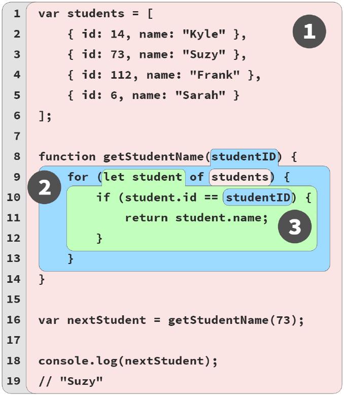

# Chapter2: Illustrating Lexical Scope

It's  important to know how works Scope, maybe we could guess and get the right answer but not always.

## Marbles, and Buckets, and Bubles... Oh My!

Kyle Simpson use an example of buckets and marbles, buckets are scope, and marbles are variables and they have colors which specify where a marble is sorted in bucket.

Example:


A scope is never partially in two different outer scopes.
Name, log, id, are all properties not variables.

Scopes can nest inside each other as shown as your program needs.

One scope just has access to variables to their own scope and higher scopes, that's why is going to finding up to up the variable reference in those scopes.

## A conversation Among Friends

Members of JS engine
- Engine: responsible for start to finish compilation and execution of our javascript program
- Compiler: Handles all the dirty work of parsing and code generation.
- Scope Manager: Collect and  maintain a lookup list of all the declared variables/identifiers.

We can understand how the engine works as like the engine were friends with the compiler and scope manager.

The example
```JAVASCRIPT
var students = [
    { id: 14, name: "Kyle" },
    { id: 73, name: "Suzy" },
    { id: 112, name: "Frank" },
    { id: 6, name: "Sarah" }
];
function getStudentName(studentID) {
    for (let student of students) {
        if (student.id == studentID) {
            return student.name;
        }
    }
}
var nextStudent = getStudentName(73);
console.log(nextStudent);
// Suzy
```
var students = [..] is not just one statement as Engine sees, the engine will compile and then execute.

Steps of a compiler will follow to handle that statement.

1. Encountering `var students`, compiler will ask scope manager if that variable exist for that bucket, If so will ignore, on the other case will create a new variable students.
2. Compiler produces code for Engine for execution. Later will handle `students=[]` assignment. When executing will ask to the scope manager if there is students accessible in the current scope, if not will look to the up scope until find it and then assign = [...].

Conversational Compilation example

**Compiler:** Hey, Scope Manager (of the global scope),
I found a formal declaration for an identifier called
students, ever heard of it?

**(Global) Scope Manager:** Nope, never heard of it,
so I just created it for you.

**Compiler:** Hey, Scope Manager, I found a formal
declaration for an identifier called getStudent-
Name, ever heard of it?

**(Global) Scope Manager:** Nope, but I just created
it for you.

**Compiler:** Hey, Scope Manager, getStudentName
points to a function, so we need a new scope
bucket.

**(Function) Scope Manager:** Got it, here’s the
scope bucket.

**Compiler:** Hey, Scope Manager (of the function), I
found a formal parameter declaration for studentID,
ever heard of it?

**(Function)** Scope Manager: Nope, but now it’s
created in this scope.

**Compiler:** Hey, Scope Manager (of the function),
I found a for-loop that will need its own scope
bucket.

Conversational execution example:

**Engine:** Hey, Scope Manager (of the global scope),
before we begin, can you look up the identifier
getStudentName so I can assign this function to
it?

**(Global) Scope Manager:** Yep, here’s the variable.
**Engine:** Hey, Scope Manager, I found a target
reference for students, ever heard of it?

**(Global) Scope Manager:** Yes, it was formally
declared for this scope, so here it is.

**Engine:** Thanks, I’m initializing students to undefined,
so it’s ready to use.

Hey, Scope Manager (of the global scope), I found
a target reference for nextStudent, ever heard of
it?

**(Global) Scope Manager:** Yes, it was formally
declared for this scope, so here it is.

**Engine:** Thanks, I’m initializing nextStudent to
undefined, so it’s ready to use.

Hey, Scope Manager (of the global scope), I found a
source reference for getStudentName, ever heard
of it?

**(Global) Scope Manager:** Yes, it was formally
declared for this scope. Here it is.

**Engine:** Great, the value in getStudentName is a
function, so I’m going to execute it.

**Engine:** Hey, Scope Manager, now we need to
instantiate the function’s scope

## Nested Scope

One of the key aspects of lexical scope is that any time an
identifier reference cannot be found in the current scope, the
next outer scope in the nesting is consulted; that process is
repeated until an answer is found or there are no more scopes
to consult.

### Lookup Failures

If is not find the identifier while looking for, then will throw an error depending if is strict-mode or not can be different.

#### Undefined Mess

There are two types of messages
- Not defined: Means not declared.
- Undefined: Means declared with undefined.

#### Global... What?

It's possible to create global variables if we are in non-strict-mode.

```JAVASCRIPT
function getStudentName() {
// assignment to an undeclared variable :(
    nextStudent = "Suzy";
}
getStudentName();
console.log(nextStudent);
// "Suzy" -- oops, an accidental-global variable!
```
Conversation example
**Engine:** Hey, Scope Manager (for the function),
I have a target reference for nextStudent, ever
heard of it?
**(Function)** Scope Manager: Nope, never heard of
it. Try the next outer scope.

**Engine:** Hey, Scope Manager (for the global scope),
I have a target reference for nextStudent, ever
heard of it?

**(Global) Scope Manager:** Nope, but since we’re in
non-strict-mode, I helped you out and just created
a global variable for you, here it is!

### Building On Metaphors

We can use a building construction to illustrate the lexical scope


## Continue the Conversation

We can practice the conversation as in this chapter did with a partner.