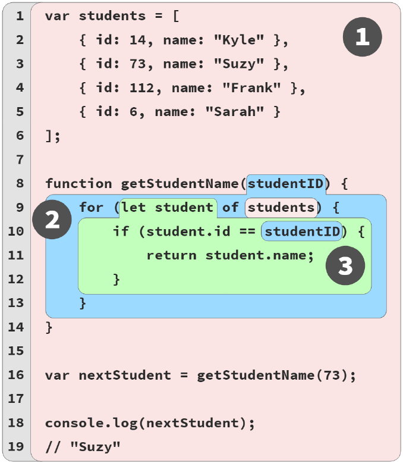

# Chapter 3: The Scope Chain

In this figure we see scope chain



## Lookup Is Mostly Conceptual

We recently learned that an identifier are searched on the same scope and then to outer until find it, but this is not how things usually work in practice.

Instead of asking to the manager scope this happens instantly because is saved the information scope in the AST in compilation time. But not everything happens there, sometimes a variable needs to be find in runtime for instance:

A variable isn't declared in the current file so is going to wait to runtime and check if other file has the variable reference in the global scope.

If a variable is not declared yet is left uncolored.

## Shadowing

Example 

```JAVASCRIPT
var studentName = "Suzy";
function printStudent(studentName) {
    studentName = studentName.toUpperCase();
    console.log(studentName);
}
printStudent("Frank");
// FRANK
printStudent(studentName);
// SUZY
console.log(studentName);
// Suzy
```

Here the studentName(blue scope) shadows studentName(red scope, global scope). So this means that is impossible to access to the studentName global in the printStudent scope.

### Global Unshadowing Trick

This technique is not a good practice and you should know to not get tripped up.

Using the global variable window

```JAVASCRIPT
var studentName = "Suzy";
function printStudent(studentName) {
    console.log(studentName);
    console.log(window.studentName);
}
printStudent("Frank");
// "Frank"
// "Suzy"
```

Consider that `window.studentName` is a reference not a copy.

Also this trick works with global scope variables and with var or functions

```JAVASCRIPT
var one = 1;
let notOne = 2;
const notTwo = 3;
class notThree {}
console.log(window.one); // 1
console.log(window.notOne); // undefined
console.log(window.notTwo); // undefined
console.log(window.notThree); // undefined
```

If any other variable than global scope is shadowed, then is never going to be accessible.
```JAVASCRIPT
var special = 42;
function lookingFor(special) {
    // The identifier `special` (parameter) in this
    // scope is shadowed inside keepLooking(), and
    // is thus inaccessible from that scope.
    function keepLooking() {
        var special = 3.141592;
        console.log(special);
        console.log(window.special);
    }
    keepLooking();
}
lookingFor(112358132134);
// 3.141592
// 42
```

### Copying is not accessing

```JAVASCRIPT
var special = 42;
function lookingFor(special) {
    var another = {
        special: special
    };
    function keepLooking() {
        var special = 3.141592;
        console.log(special);
        console.log(another.special); // Ooo, tricky!
        console.log(window.special);
    }
    keepLooking();
}
lookingFor(112358132134);
// 3.141592
// 112358132134
// 42
```

We're copying here, so this is not accessing to that scope variable, the same if we use an object and mutate via reference copy is not the same as accessing. We can't reassign the data.

### Illegal Shadowing.

`let` can shadow `var`, but `var` cannot shadow `let`:
```JAVASCRIPT
function something() {
    var special = "JavaScript";
    {
        let special = 42; // totally fine shadowing
        // ..
    }
}
```

In this example there are syntax error because `var special` is trying to declare a function-wide special and try to cross the boundary and hop over the let declaration of the same name which is not allowed.

```JAVASCRIPT
function another() {
    // ..
    {
        let special = "JavaScript";
        {
            var special = "JavaScript";
            // ^^^ Syntax Error
            // ..
        }
    }
}
```

Here no exception because there is a function boundary and doesn't has to hop over let.

```JAVASCRIPT
function another() {
    // ..
    {
        let special = "JavaScript";
        ajax("https://some.url",function callback(){
            // totally fine shadowing
            var special = "JavaScript";
            // ..
        });
    }
}
```
## Function Name Scope

**Function declaration**
- Does hoist.
``` JAVASCRIPT
function askQuestion() {
    // ..
}
```

**Function expressions(Anonymous function expression)**
- Doesn't hoist
```JAVASCRIPT
var askQuestion = function(){
    // ..
};
```
**What happens to the identifier inside the function**
In this example
**(named function expression)**
```JAVASCRIPT
var askQuestion = function ofTheTeacher() {
    console.log(ofTheTeacher);
};
askQuestion();
// function ofTheTeacher()...
console.log(ofTheTeacher);
// ReferenceError: ofTheTeacher is not defined
```
askQuestion is in the outer scope but ofTheTeacher is inside the function itself(Not exactly).

ofTheTeacher is defined read-only:

```JAVASCRIPT
var askQuestion = function ofTheTeacher() {
    "use strict";
    ofTheTeacher = 42; // TypeError
    //..
};
askQuestion();
// TypeError
```

## Arrow Functions

Arrow functions are lexically anonymous, no have direct related identifier.

Syntax brevity
```JAVASCRIPT
() => 42; //Return 42
id => id.toUpperCase(); //parameter id and return something.
(id,name) => ({ id, name }); //parameter id,name and return an object
(...args) => {// use {} to many statements return, and ...args for arguments because doesn't has arguments
return args[args.length - 1];
};
```
Arrow functions are lexical scope the same as function
## Backing out

- Function expressions and declaration define a new scope
- Positioning scopes nested, create scope chain and that controls variable access upward and outward.
- Each scope offers a clean slate for set of variables.
- When a variable is repeated at different levels of scope chain there is shadowing.
