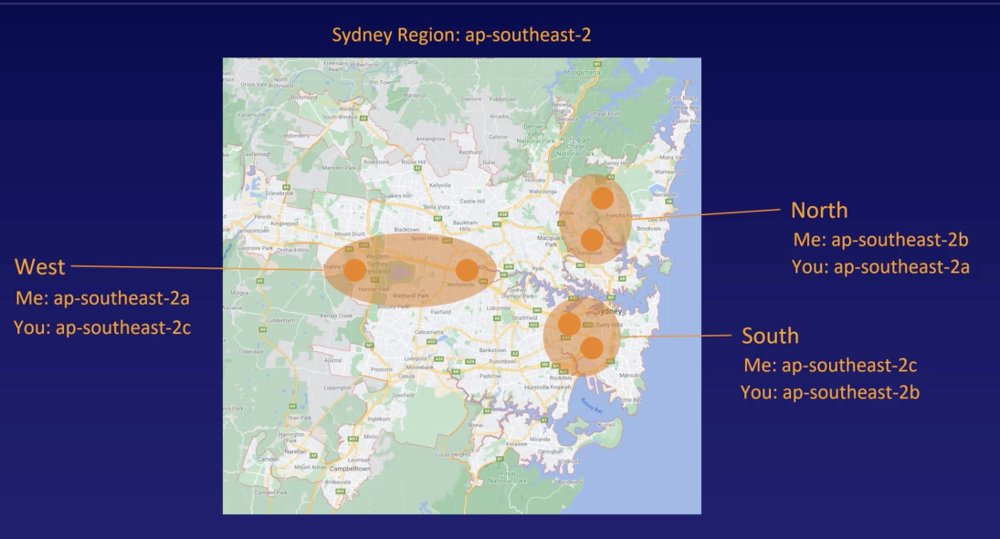

# What is the cloud?
Collection of services which creates a platform (Someone else computer)
- Media Services
- Databases
- Security
- Virtual Servers
- Networking
- Data Storage
- Analytics 
- Machine Learning

Aws is the leader of cloud platform with 32 %, Microsoft Azures 19% and Google with 7%. Is the leader because
- First in adopt cloud service
- Cheap, Pay as you go.

# Regions and Availability zones

There are countries aka regions in which there are data centers in all the world. For Instance
- Tokio - Japan
- Sao Paulo - Brasil
- Ohio - USA
- Oregon - USA
- Beijing - China
- Sydney - Australia 

Every region has multiple isolated and physically separate availability zones, they all have independent power, security and cooling. All of those availability zones are connected with each other with a redundant, ultra high speed and low latency network.

Example

