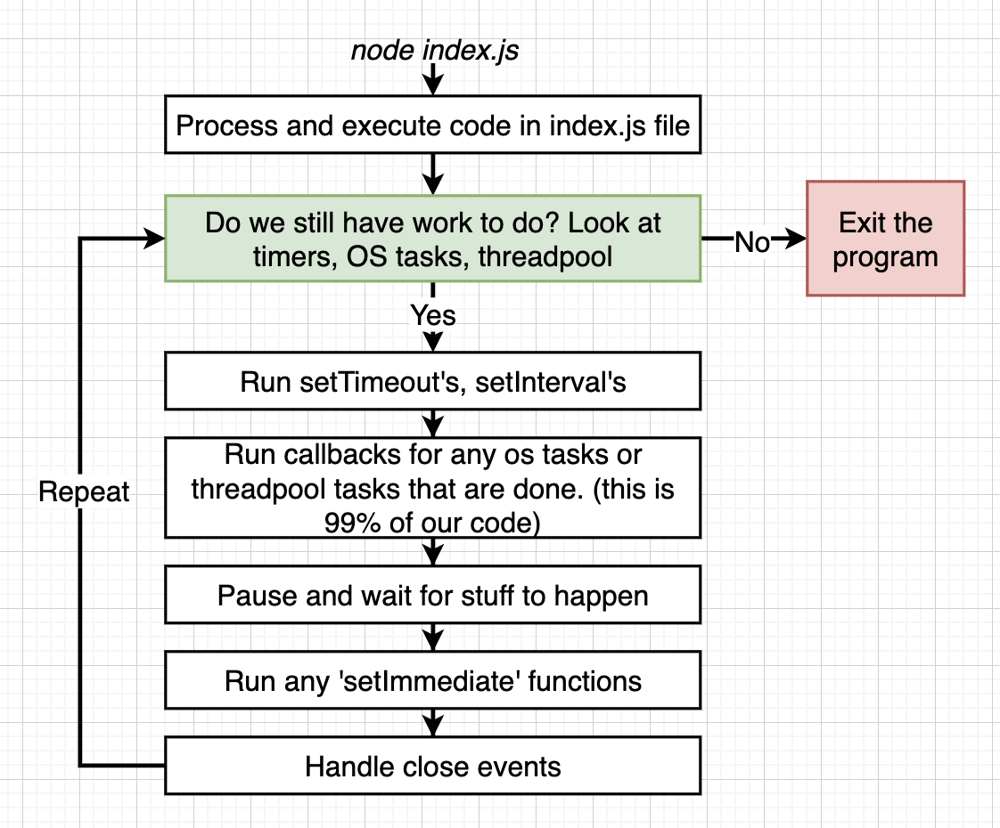
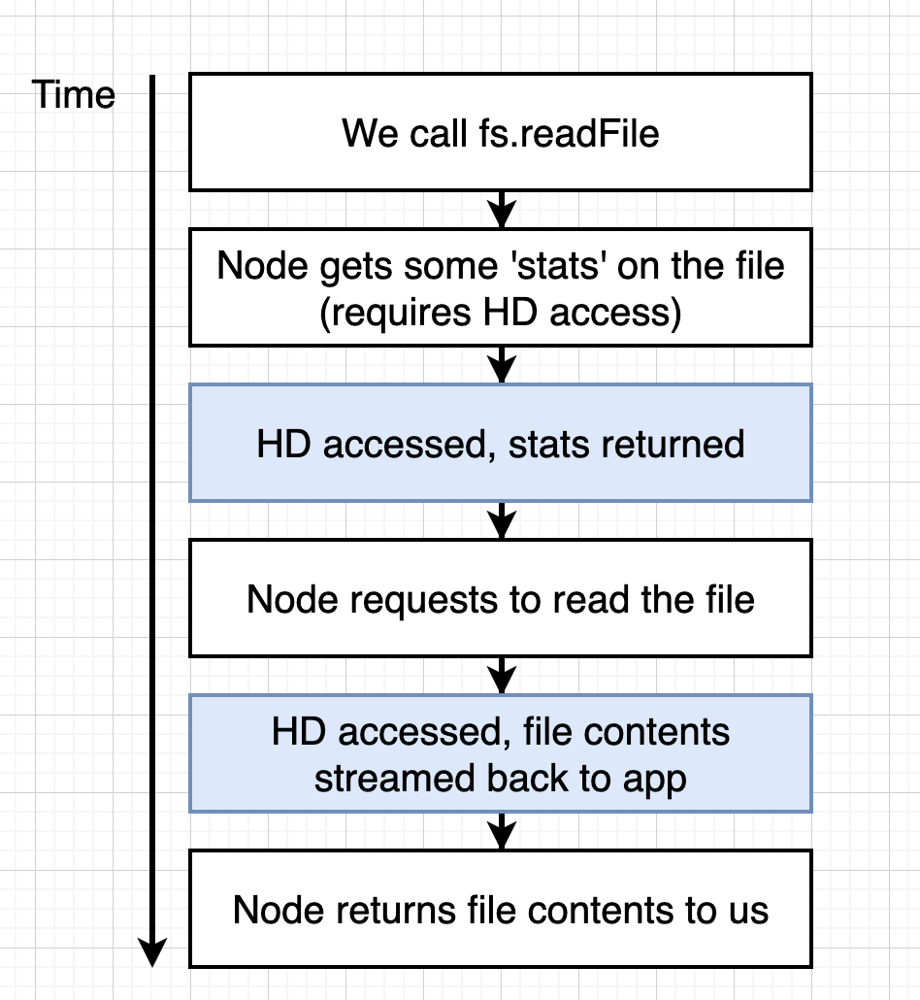

# Internals of Node

Execution process of nodejs

But why we use NodeJS if we could have direct interaction with V8 and Libuv?

Because NodeJS implemented apis, like http, fs, crypto, path and others, that allow us to interact with  javascript on the other hand we would have to use c++.

- **NodeJS** check if the parameters and types are correct, then Executes C++ code, it uses V8 and libuv.
- **V8** It's used to translate the javascript arguments and transform it into C++ definition.
- **Libuv** It's used to have access to CPU, Network, and fylesistem.

# Event loop and Process

Process: Is an instance of an running program, can have one thread or multiple ones

Thread: It's a set of instructions that It's going to be executed by the cpu

OS scheduler: Prioritize which threads needs to be executed by the CPU core, For instance I/O like the keyboard.

CPU core: Execute the thread (can execute multiple threads with multithreading or hyperthreading)

## How it works the event loop?

In a thread there is the event loop that is the control structure that decide what to do at any given point of time. In a single instance of our running program there is only one eventloop .
Eventloop It's single threated.

We refer to a **Tick** as an execution of the eventloop

You can check it in `./code/loop.js`

## Is nodeJS single threaded?

We can think that NodeJS is single threaded but when we execute the next code isn't `./code/thread2.js` because it should execute one by one and was executed simultaneously.

When we execute the function `pbkdf2` at the end we are executing libuv, and libuv has something called threadpool that has 4 threads to execute intensive task calculation like hashing `pbkdf2`.

We can see the following code in `./code/thread5.js` to check when we have 5 executions of `pbkdf2`.
We can see that 

- It's executing the first 4 functions at the same time, because it's using my 4 cores of my macbook pro 2020 (different at the video because my computer is different)
- the fifth thread it takes more time because as we mentioned eventloop has set by default 4 threads, so the fifth thread it's going to wait to later be executed.

We can also change the default threads that the eventloop currently use with `process.env.UV_THREADPOOL_SIZE = 5;`

## Libuv OS Delegation

There are some cases in which some of the operations that libuv does is not delegated to the thread pool but for the OS Delegation.

Check an example using http requests in `./code/async.js`.

Almost all network modules in node are delegated to OS Delegation.

## Hard interview question

We can check in `./code/multitask.js` one of the most difficult interview tasks, but basically fs has two parts in which waits that's why it's finished in third position, http request is first because it's managed by the OS.

